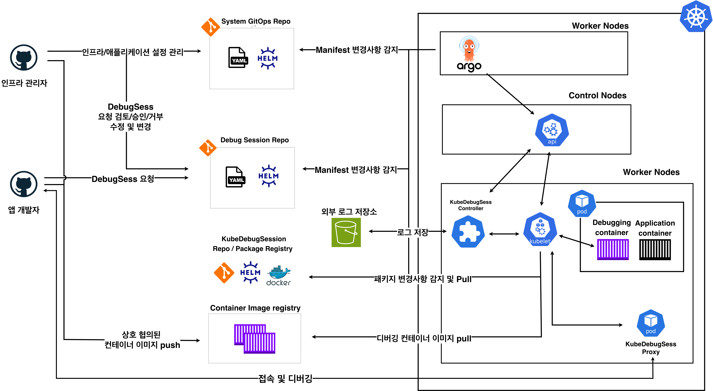

# KubeDebugSess: <br>GitOps 워크플로우 통합형 라이브 디버깅 세션 관리자

### 💡 Project Overview

KubeDebugSess은 DevOps 방법론인 GitOps의 선언적 모델 원칙과 기존 인프라 관리 방식을 준수 및 유지하면서도, 애플리케이션 개발자의 k8s 클러스터 내 컨테이너에 대한 디버깅 접근성 향상을 위한 프로젝트입니다.

보다 자세한 내용을 해당 [링크](https://softcon.ajou.ac.kr/works/works.asp?uid=2189&category=P)에서 확인하실 수 있습니다.

### 🏛️ Best Practice Architecure

</img>

관심사의 분리 / 애플리케이션 개발자의 인프라 관련 접근 제한 등을 이유로 KubeDebugSess은 기존 k8s 관리용 GitOps repo와는 분리된 디버깅 세션용 GitOps repo를 별도로 사용하는 걸 권장합니다.

해당 repo는 개발자/관리자가 동시 접근 가능한 repo로 DebugSess에 대한 Commit / PR / Merge 등을 관리합니다.

### 📂 How to Install

#### 🔖 Option 1: ArgoCD

기존 k8s 관리용 GitOps Repo에서 다음과 예시와 같은 ArgoCD의 Application 설정을 통해 해당 프로젝트를 설치하실 수 있습니다.

자세한 설정 방식은 다음 [ArgoCD 문서](https://argo-cd.readthedocs.io/en/latest/user-guide/multiple_sources/#multiple-sources-for-an-application)에서 확인하실 수 있습니다.

```yaml
apiVersion: argoproj.io/v1alpha1
kind: Application
metadata:
  name: kubedebugsess
  namespace: argocd
spec:
  project: default
  sources:
    - repoURL: oci://registry-1.docker.io/oxan0nme/kubedebugsess
      chart: kubedebugsess
      targetRevision: 0.0.1
      helm:
        valueFiles:
          - $values/kubedebugsess/values.yaml

    - repoURL: "<your k8s gitops repository url>"
      targetRevision: local
      ref: values

  destination:
    server: https://kubernetes.default.svc
    namespace: kubedebugsess-system
  syncPolicy:
    syncOptions:
      - Timeout=300
      - CreateNamespace=true
    automated:
      prune: true
      selfHeal: true
```

#### 🔖 Option 2: Helm Chart

```
helm install kubedebugsess \
  oci://registry-1.docker.io/oxan0nme/kubedebugsess \
  --version 0.0.1 \
  -n kubedebugsess-system \
  --create-namespace \
  -f ./values.yaml
```

helm이 설치된 상태에서 위의 커맨드를 수행하시면 됩니다.
`./values.yaml`의 경우, 아래 `Custimization`에서 설명한 오버라이딩할 설정들을 명시한 파일입니다.

### 📄 DebugSess Example

```yaml
# DebugSess.yaml example
apiVersion: ajou.oxan0n.me/v1alpha1
kind: DebugSession
metadata:
  labels:
    app.kubernetes.io/name: kubedebugsess
    app.kubernetes.io/managed-by: kustomize
  name: debugsession-asdf
  namespace: test-app
spec:
  targetPodName: test-app-busybox-deploy-5c9458ffcd-dwj8g
  targetNamespace: test-app
  targetContainerName: test-app-busybox
  debuggerImage: busy-box
  ttl: 600
  debugSecurity:
    runAsUser: 0
    runAsNonRoot: false
    privileged: false
    allowPrivilegeEscalation: true
    readOnlyRootFilesystem: true
    capabilities:
      add:
        - ALL
      drop:
        - SYS_PTRACE
```

DebugSess은 디버깅을 수행하고자 하는 타겟 컨테이너, 타겟 컨테이너가 위치한 파드/네임스페이스, 사용할 디버깅 컨테이너 이미지, 접근 권한 등을 설정하는 객체입니다.

개발자는 해당 설정들을 담은 yaml파일을 디버깅 세션 관리용 GitOps 레포에 Commit/PR하고 관리자는 이를 보고 승인/승인 거절하는 방식으로 디버깅 컨테이너의 실행 여부를 결정할 수 있습니다.

### 🛠️ Custimization

위에서 프로젝트를 설치 시, 아래와 같은 `values.yaml`을 오버라이딩하여, 각 k8s 클러스터의 설정 및 운영 방침에 적합하게 본 프로젝트를 커스텀하여 사용하실 수 있습니다.

```yaml
controllerManager:
  env:
    # Setup Webhook URL to get notification about debugging container
    WEBHOOK_URL: ""

# Set up AWS Bucket Config for Debugging Log Dumps
aws:
  config:
    name: kubedebugsess-config
    keys:
      region: AWS_REGION
      bucket: S3_BUCKET_NAME
  secret:
    name: kubedebugsess-aws
    keys:
      accessKey: AWS_ACCESS_KEY_ID
      secretKey: AWS_SECRET_ACCESS_KEY

debugProxy:
  replicas: 1
  image:
    # Can Set up your own proxy image for access Debugging Container
    # Make sure the proxy image calls k8s attach API
    repository: docker.io/oxan0nme/kubedebugsess-proxy
    tag: v0.0.1
    pullPolicy: IfNotPresent
  serviceAccount:
    create: true
    name: kubedebugsess-proxy-sa
  resources:
    requests:
      cpu: 50m
      memory: 64Mi
    limits:
      cpu: 200m
      memory: 128Mi
  port: 8080
  nodePort: 32080
  logLevel: info
```
